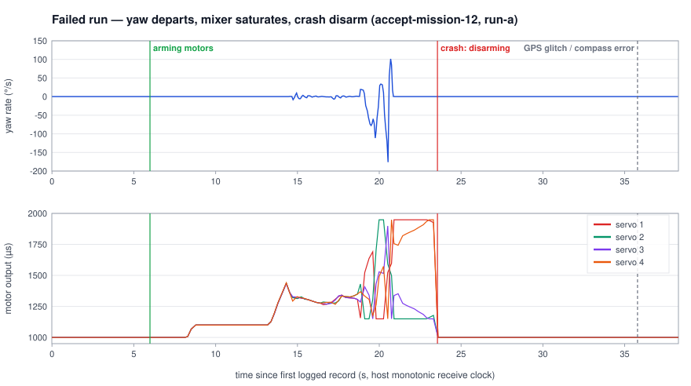
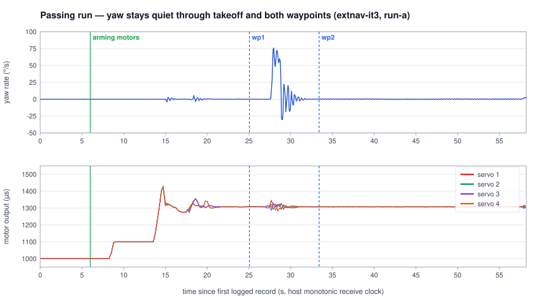
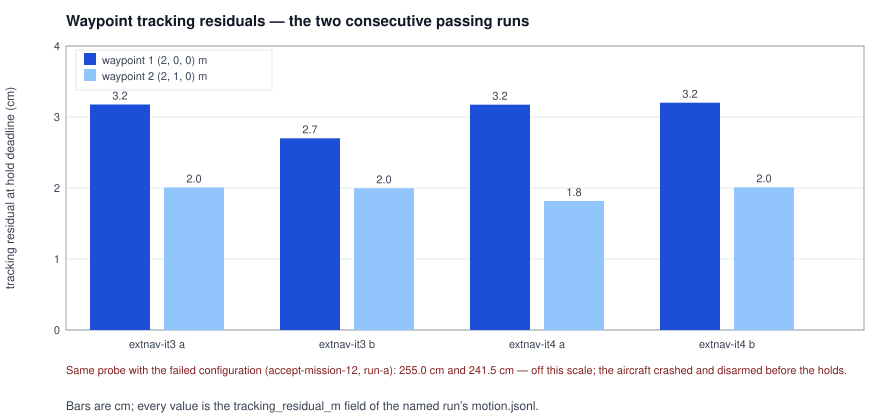

# embodied

A continuously involved cloud multimodal drone pilot for unfamiliar indoor
spaces: the pilot is meant to gather information, navigate, reason about what
it sees, revise its plan, and report a supported result. The near-term work is
a measured path to that goal on a simulator first. The stack pairs Webots
R2025a with ArduPilot SITL (ArduCopter) through one adapter that owns both
sides, and every result is produced by code that records its own evidence and
can be re-run from a clean checkout.

Everything here is simulator-only. The one flown claim this repository makes
today is a closed compatibility gate, described under Results. There is no
claim of localization from onboard sensing, no obstacle avoidance, no
autonomy, and no real flight.

## Status

Works today:

| Item | Evidence |
|---|---|
| Webots/ArduPilot compatibility gate closed: two consecutive invocations, 16/16 checks each, both guided-motion checks green, waypoint holds within 1.8-3.2 cm | receipts for `extnav-it3` and `extnav-it4`, described below |
| Test suite: 146 tests pass on `main` | `python -m pytest -q`, see Reproduce it |
| Measurement instrument: recorder, referee and grader with structural truth isolation, tested against hand-checkable episodes | `tests/bench/`, `tests/fixtures/bench/` |
| Stereo calibration pipeline runs end to end; rectification gate (B1) passed; the floor-depth gate (B3) failed its pre-registered criterion and the stage is recorded as blocked rather than passed | `work/runs/p01-calibration/` (local evidence store) |

Not proven yet, stated plainly:

| Gap | Why |
|---|---|
| Sensor-derived localization | the estimator in the green runs flies on the simulator's own pose, fed to EKF3 as external navigation |
| Floor-plane metric depth | 5.4% of floor samples within the declared tolerance against a declared 95% minimum; the criterion itself may be ill-posed for a textureless plane |
| Autonomy, obstacle avoidance, cloud pilot | not built; the current stage is the airframe-and-transport foundation they need |
| Real flight | no hardware has been flown |

## Results

The compatibility gate is one command that starts Webots and ArduPilot SITL
on a pinned indoor scene, checks 16 conditions spanning transport, clocks,
sensor frames, estimator behaviour and guided motion, and writes a receipt
with hashes of every artifact. The finish line required two consecutive
invocations, each with all 16 checks green, with no threshold weakened.

That finish line is met. The two runs:

| Invocation | Receipt | Gate | Checks | Waypoint residuals |
|---|---|---|---|---|
| `extnav-it3` | `work/runs/p00-airframe/extnav-it3-2026-09-25T1834Z/receipt.json` | pass | 16/16 | 3.18 cm, 2.01 cm |
| `extnav-it4` | `work/runs/p00-airframe/extnav-it4-2026-09-25T1838Z/receipt.json` | pass | 16/16 | 3.17 cm, 1.82 cm (run a) and 3.20 cm, 2.01 cm (run b) |

The route each run flies: arm, take off to 1.5 m, hold, transit 2 m east,
hold 8 s, transit 1 m north, hold 8 s. Residuals are the distance between the
autopilot's position sample at each hold deadline and the commanded local-NED
waypoint, recorded in each run's `motion.jsonl`.

What the gate proves, in the receipt's own words: transport, clocks and
frames, under a simulator-interface configuration. What it does not prove:
the estimator's position and attitude come from the simulator's ground-truth
pose, delivered to EKF3 through MAVLink `VISION_POSITION_ESTIMATE` with
`EK3_SRC1_*` set to ExternalNav. That is deliberate for this stage, it is
recorded as a limitation in every receipt, and replacing it with
visual-inertial navigation over the same interface is the next stage.

### The figures

A failing attempt next to a passing one, same probe, same scene, same command:



In the failing run the yaw rate departs about 8 s after arming, the motor
commands saturate, and the crash detector disarms the aircraft before any
waypoint is attempted. The passing runs hold heading through the same
manoeuvre with a decaying wobble on the first transit.






Every plotted number comes from the log file named in `assets/README.md`,
which also states the channels and their limits.

## How it is built

Four ideas carry the design.

**One adapter between simulator and autopilot.**
`src/embodied/platform/webots_ardupilot.py` starts both processes, owns their
lifecycle, and speaks to each side in its own terms. Toward Webots it reads a
framed sensor stream from the scene's Python controller: accelerometer, gyro,
inertial unit, GPS at 2 ms, and a left/right stereo pair at 100 ms. Toward
ArduPilot it converts ENU to NED, linearizes the controller's square-root
throttle curve into PWM microseconds, publishes guided
`SET_POSITION_TARGET_LOCAL_NED` setpoints, and feeds EKF3's external-nav input
at 25 ms. Nothing on the Webots side knows about MAVLink; nothing on the
autopilot side knows about Webots.

**Records are frozen and missing stays missing.**
`src/embodied/contracts/records.py` defines each record once. Fields have no
defaults: a value that was not measured is `null`, never a quiet `0` or empty
string, so a fabricated default cannot pass for a measurement downstream.

**Commands write receipts, not impressions.**
`src/embodied/cli.py` gives every command the same contract: a JSON receipt
with the code revision, config hash, gate status, reasons, limitations, and a
SHA-256 over every artifact. Exit codes mean exactly: 0 a valid complete
result, 1 a command error, 2 blocked by a missing prerequisite, 3 pending
adjudication. A command that ran to a losing outcome is still a valid result;
a completed episode where the aircraft crashed is recorded as exactly that.

**The score cannot see the answer key.**
`src/embodied/bench/` splits the measurement instrument in three. The
recorder projects what the runtime saw. The referee holds the scenario's
hidden facts in a store directory beside the episode, never inside it, and
the module has no read function at all. The grader alone reads the truth and
grades every claim twice: is the claim true against the hidden facts, and
does the cited evidence support it. A true guess with no support does not
pass.

Calibration (`configs/first_indoor.yaml`, `scenarios/compat/calibration.json`)
keeps its declared values, its pre-registered gate bounds, and its referee
geometry apart, so a gate bound cannot drift after results are seen. The
stereo stage ran end to end against stored flight evidence: rectification
passed, floor-plane depth failed its own pre-registered criterion, and the
stage is recorded as blocked. The failure is kept, not edited away.

```
src/embodied/            platform adapter, contracts, CLI, bench, perception
configs/                 one YAML per stage; every number is configuration
scenarios/compat/        Webots world, the scene's controller, parameter files, vehicle model
tests/                   the suite (146 tests), including hand-checkable bench episodes
scripts/                 bootstrap.sh and repository checks
assets/                  the figures in this README, with captions
```

Runtime state lives in `work/` (ignored by git): the ArduPilot clone, the
Webots install, and every run's raw evidence. `work/runs/` is the local
evidence store this README's numbers cite.

## Reproduce it

Pinned versions, from `pyproject.toml` and the environment this was measured
on:

| Requirement | Version |
|---|---|
| Python | >= 3.11 (developed and measured on 3.14) |
| numpy | 2.4.4 |
| PyYAML | 6.0.3 |
| pymavlink | 2.4.49 |
| pytest (dev) | 9.0.3 |
| pexpect | 4.9 (used by ArduPilot's autotest tooling) |
| Webots | R2025a, app bundle at `work/Webots.app` |
| ArduPilot | commit `af8525911b49a4c2a3bdc83bc5ed57e1d0098134`, built with waf |

The config expects this layout under the repository root (all paths in
`configs/first_indoor.yaml` are relative to it): `work/ardupilot/` with the
built SITL binary at `build/sitl/bin/arducopter`, and the Webots app bundle
at `work/Webots.app` (macOS layout; the adapter launches
`work/Webots.app/Contents/MacOS/webots`). This was developed on macOS;
nothing else has been tested.

`scripts/bootstrap.sh` does the steps below. To do them by hand:

```sh
# 1. Python environment
python3 -m venv .venv
.venv/bin/pip install -e '.[dev]'

# 2. ArduPilot SITL at the pinned commit, with submodules
git clone --recurse-submodules https://github.com/ArduPilot/ardupilot.git work/ardupilot
cd work/ardupilot
git checkout af8525911b49a4c2a3bdc83bc5ed57e1d0098134
git submodule update --init --recursive
./waf configure --board sitl
./waf copter                 # produces build/sitl/bin/arducopter
cd ../..

# 3. Webots R2025a
#    Download from cyberbotics.com and place the app bundle at work/Webots.app
#    (this step is manual; there is no scripted Webots download)
```

Then run the suite and one gate invocation:

```sh
.venv/bin/python -m pytest -q
# expected: 146 passed (8-10 minutes)

.venv/bin/python -m embodied compat --config configs/first_indoor.yaml \
    --output work/runs/compat-check-1
```

Success looks like: exit code 0; `work/runs/compat-check-1/receipt.json` with
`"status": "complete"` and `"gate_status": "pass"`; `checks.json` with all 16
checks passing, including both `3_guided_local_ned_motion` items; waypoint
residuals of 2-3 cm in `run-a/motion.jsonl` and `run-b/motion.jsonl`. One
invocation takes about 10-15 minutes. The finish line this report claims is
two consecutive passes, so run it a second time into a second fresh
directory.

## Troubleshooting

Traps this project hit, so the next person does not have to:

- **Free the ports first.** The probe binds UDP 9002 and 9003 and TCP 5760.
  A previous run that did not shut down cleanly holds them. Check with
  `lsof -i :9002 -i :9003 -i :5760`.
- **A fresh output directory per run.** The CLI refuses to write over an
  existing `receipt.json`. Reusing a directory is not possible by design;
  pass a new `--output`.
- **Benign Webots console noise.** These appear on every run and mean
  nothing: `Skipped unknown 'solid' field in IndexedFaceSet node` (from a
  Cyberbotics proto), `logo.png is not a power of two` (from an ArduPilot
  texture), and `Mesh 'iris_009-mesh' has more than 100'000 vertices`.
- **The pinned upstream example does not initialise on this host.** The
  ArduPilot tree's own Webots_Python example (the one pinned at the commit
  above) records zero MAVLink heartbeats in 120 s here. The cause is in its
  source, not in this repo: its controller reuses a frozen simulator timestamp
  between servo-triggered steps while SITL advances its clock only by the FDM
  timestamp delta, so the two never complete a handshake. This is a
  documented outcome of the pin, not a bug waiting for a fix; the compat
  adapter in `src/embodied/platform/` is the path that works.

## What went wrong

The gate did not pass first, or tenth. Getting here took 19 gate invocations,
most of them two simulator runs each: 15 failed or were invalid before the
first pass, and the verified consecutive pair was invocations 18 and 19. Each
failure had a different root cause, and the project's own habit of treating a
flight as an experiment instead of reading the source first is the reason the
list below is so long. That lesson is part of the record.

- **The baseline never initialised.** Three campaigns against the pinned
  upstream example produced zero heartbeats. Two workarounds (pacing the
  controller, moving its loop to the main thread) also failed. The mechanism
  was finally found by reading the pinned source: a handshake and clock
  mismatch, not a configuration problem. The fix was to stop using that
  controller and write the adapter described above.
- **Instrument threading.** With aircraft and harness both live, the sensor
  reader shared a thread with the checklist judging the flight, so reads
  stalled while judging ran. Stereo frames went stale by tens of seconds.
  Reading now runs on its own adapter-owned thread.
- **A shed acknowledgement.** The arming acknowledgement was dropped from a
  full bounded queue: the waiter polled at 50 ms against a stream producing
  about 510 records per second. The wait now consumes what the stream
  produces.
- **Judge semantics.** The motion judge compared measured displacement
  against the absolute target coordinate instead of the commanded step, so a
  correct descent read as motion against the command and the check could not
  pass for any flight behaviour. The judge now reads direction against the
  commanded step.
- **Out-of-range gains.** The pinned example's parameter file had carried a
  workaround into the wrong place: angle P at 0.5 against a documented range
  of 3-12, and a yaw rate P of 0.02, below the parameter's own floor of 0.10.
  The aircraft wallowed, then departed yaw-first at 180-280°/s into a crash
  disarm. Restoring the firmware's stock values exposed the next problem
  instead of fixing this one, which is how the next two items were found.
- **A takeoff handover transient.** Guided position control took over from
  the takeoff controller at 0.75 m while the aircraft was still climbing at
  about 2.3 m/s toward a 1.5 m target, overshot to 2.5-2.7 m, and hit the
  collective floor. The climb speed is now limited to 1.0 m/s, and the
  adapter holds ground idle before permitting early throttle.
- **Finally, estimation.** Two flights that changed only the estimator's yaw
  source scored 10/16 and 8/16, worse than before. The real fault: EKF3 was
  fusing SITL's synthesized magnetometer, which diverged from the simulated
  airframe's true yaw. The working change removes the compass from fusion
  entirely and feeds the simulator's own pose to EKF3 as external navigation.
  The first invocation with that change passed 16/16; after one readiness
  timeout on the added stream was fixed with a slower pose cadence, two
  consecutive passes closed the gate.

The receipts for every failed attempt are kept in the local `work/runs/`
store with their hashes and reasons. The figure at the top of Results is one
of those failures.

## Roadmap

1. Replace the truth pose feed with sensor-derived visual-inertial
   navigation, over the same `VISION_POSITION_ESTIMATE` interface, so the
   estimator flies on what the cameras and IMU sense.
2. Re-validate floor-plane metric depth from flown viewpoints, or re-declare
   the criterion with justification, so the calibration stage can close.
3. Bench campaigns with the recorder/referee/grader instrument on
   indoor search and inspection episodes.
4. The cloud multimodal pilot itself: grounded objectives, spatial memory,
   and revision under changed instructions.

No date is attached to any of this, and none of it is claimed.
