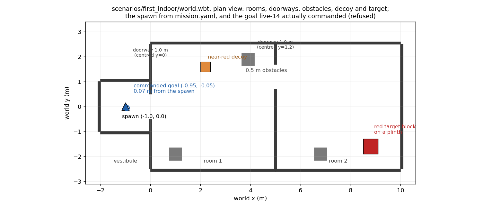
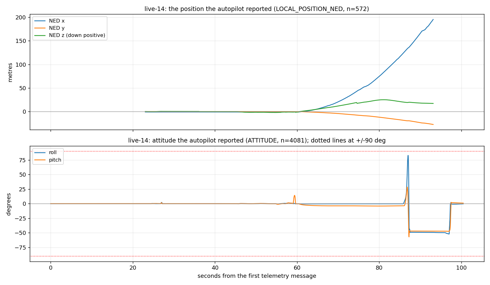
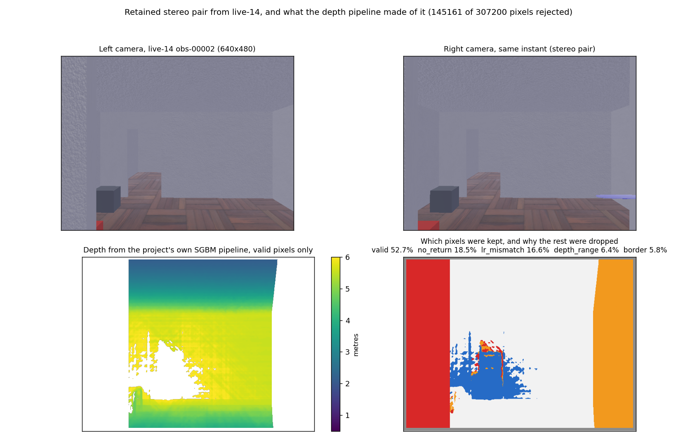
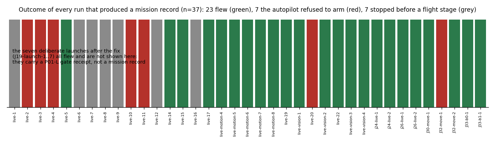
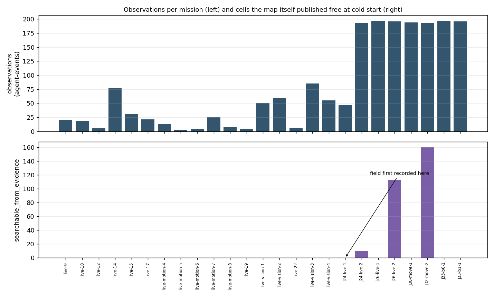
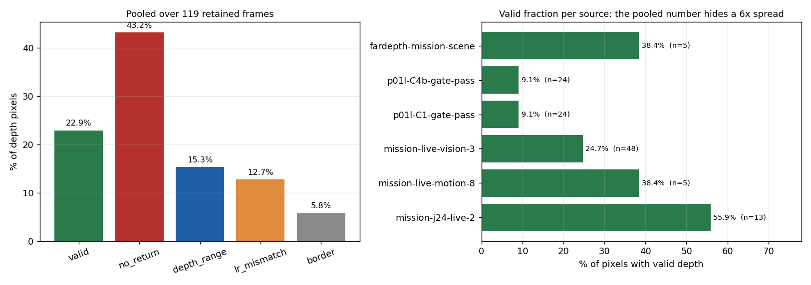
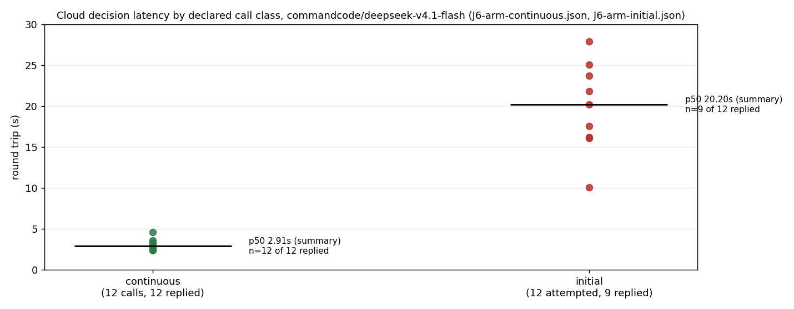
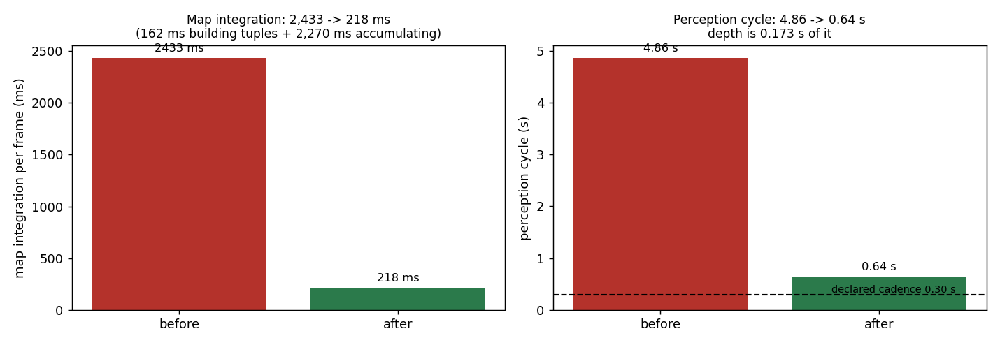

# A cloud pilot for a simulated drone

## What this is

A drone has to fly into rooms it has never seen, find a red block, look at it closely, and come
back. A cloud model decides what to look for and where to go. A local planner turns those decisions
into motion. The drone flies under ArduPilot. A separate evaluator holds the truth about the task
and scores the flight afterwards. The pilot never sees that truth.

The work is in a simulated indoor scene. Simulation evidence says nothing about real flight.

## The goal

From `design/docs/GOAL.md`:

> Build a drone pilot that accepts unfamiliar objectives, learns what matters from its own
> observations, moves through unfamiliar places, changes its approach when evidence changes, and
> reports what it did and what remains uncertain.

The comparison target is a capable human pilot. Reusable capabilities matter; one script per
mission does not show general autonomy.

Three constraints shape the design. The cloud stays involved while the drone moves and can ask for
another look. The cloud sends no motor or flight-controller commands. One local planner owns the
only setpoint stream to the autopilot, and it refuses a goal it cannot support with current
evidence. Local execution does not wait for the cloud to handle an obstacle.

Success does not mean a high score on one task. Simulation evidence applies to the declared
simulator, sensors, models, control stack and task distribution. Nothing here shows real-world
flight capability.

## What is new here

Facts about the design, not claims about them:

- The cloud model is called **while the aircraft is moving**. It is not a planner run once at the
  start. Every in-flight call carries a fresh frame and the current spatial evidence, and the reply
  can revise what the aircraft is doing.
- **The cloud never sends a motor command.** Its output is a selection in an image or a typed
  tactical decision. `pilot/` turns that into a goal proposal; `navigation/` decides whether the
  goal is admissible and, if it is, produces a timed trajectory. Only the executor publishes
  setpoints.
- **One owner for the setpoint stream.** The planner, the executor and the validator are separate
  modules, and only the executor writes to the autopilot.
- **The evaluator holds truth the pilot cannot reach.** The bench writes a truth store beside the
  episode, not inside it. The agent-facing surface refuses every read of a truth member, by name, by
  relative path and by traversal. A probe re-proves this against the real referee, the real
  recorder and the real grader (`scenarios/first_indoor/tools/probe_truth_isolation.py`).
- **Refusals are first-class records.** When the local system declines to act, the reason is
  written into the run. `unsupported_space`, `no_known_supported_route` and
  `no reply arrived inside the pre-flight window` are all in the artifacts as readable strings.
- **Failures stay in the record.** `design/docs/LEARNED-FAILURES.md` holds 42 defects with their
  real causes, 13 attributions that were believed and then refuted by measurement, and 22
  transferable traps. Nothing was deleted when it turned out to be wrong.

The first two are wired and **measured, not assumed**. **The cloud has flown**: in `J33-b1-2` B1
made exactly one reasoned call while stationary on the ground and adopted the plan it returned
(`approach → inspect → return`); in `J33-b2-3` B2 made that call and then thirteen more in flight,
each carrying a quarter-scale frame. B0 built no provider, no packet and made no call, asserted from
its own record rather than assumed. What is **not** shown is any effect on the outcome: the aircraft
never translates, so all three arms report `not_found` and `not_inspected` and every score is
`pending` (`work/runs/p05/J33-cloudfly-REPORT.md`). The limits are listed in full at the end of this
document.

## How this was approached

Six rules, applied on every piece of work. Each one cost something to learn.

**Measure before changing anything.** Read the source of every component in the causal path, and
mine the artifacts already on disk. Experiments confirm; they do not discover.

**Never weaken a bound, threshold, check or test to reach a pass.** An honest `unresolved` beats a
dressed-up success. Changing a criterion needs a written, sourced justification and the owner's
ruling.

**State the prediction before the experiment.** Write down what you expect, and what result would
prove you wrong. Several predictions in this repository are recorded next to the measurement that
refuted them.

**State the mechanism, not the headline.** "27 occurrences of an empty propagation interval, zero
on a flight that passed" is a mechanism. "The estimator was unstable" is not.

**Read the logs after every run.** The summary is not the record. Correlate a log to its run by
something unique inside the run, not by timestamp. When the summary and the logs disagree, the logs
win and you say so.

**One owner per shared contract.** Two writers in one file produced two defects here. A third was
caused by the same file being edited from the wrong working tree.

Two moments where the rules changed the outcome:

**The "constant 2.276 m bias" was not a bias.** A run measured E1's error as `p95 == max`, to sixteen
digits, and a plausible story was written: pre-motion ZUPT corruption sealing a displaced frame. The
next mission was briefed around it. Then someone counted the samples: the last 332 rows carried one
identical timestamp and one identical position, spanning 10.13 s of wall clock after the simulator's
clock stopped. A crashed vehicle's terminal pose had been counted 332 times, which is why the 95th
percentile equalled the maximum. The real cause was two properties that were declared and never
implemented, and the fix was a watchdog and a window bound, not a filter
(`LEARNED-FAILURES.md` §1.1; `work/runs/p01-localization/FIXER3-REPORT.md`).

**A change was reverted because its correlation did not survive.** An agent changed `drain()` to poll
the estimator before feeding it. Runs carrying the change lost 3 of 3; runs without it lost 0 of 6.
The agent wrote, in its own report, *"No mechanism has been measured; only the correlation above"*,
reverted the change, and left the correlation in the record. The tumble's real mechanism was found
later by a different mission, and the honest label is what made that possible
(`LEARNED-FAILURES.md` §1.4, §3 T6).

## The obstacles, with their numbers

Each of these was believed, measured, and changed. The measurement is the entry.

### Perception had never run

Nine missions flew and returned reports. The map stayed empty. The cause: `_perception_queue` was
created and drained but nothing ever wrote to it. The queue's consumer ran, found nothing, and
returned. No summary showed it, because a drained empty queue and a fed queue look the same from
outside.

Fixed, and the mission then observed the world for the first time. Observed frames went from 7 to
between 55 and 197 (`work/runs/p05/J5-mission-REPORT.md`; `LEARNED-FAILURES.md` defect 31).

### The map was never searchable

Every mission summary reported `searchable_cells: 1`. Briefs quoted that number as proof the map
could not hold a room. It was wrong in a specific way: the field counted cells that were free *or*
covered by the self-occupied exemption, which marks the aircraft's own envelope.

A new field, `searchable_from_evidence`, counts only cells the map itself publishes free. In every
run before that change it was **zero**. A map with no genuinely searchable cell admits no goal,
whatever its frontier count says (`J24-sim-REPORT.md`; `LEARNED-FAILURES.md` defect 33, trap T20).

### A stereo frame overtook its own inertial samples

The aircraft disarmed in mid-flight while still in GUIDED mode, and every subsequent setpoint was
refused. It was not a mission bug and not a forced state. A stereo frame was being handed to the
estimator before the inertial samples that must precede it, so the propagator found an empty
interval: `No IMU measurements to propagate with (0 of 2)`, 22 times in one run and 27 in another,
and **zero** times on a flight that passed its gate on the same stack.

The filter froze at 2.90 m of integrated distance, then ran to 48 m inside a 6 m room. It kept
publishing the diverged pose. EKF3 followed it. The controller was told it was above its target and
floored the throttle. The aircraft landed for real, and the firmware's own auto-disarm did the rest.

Fixed by ordering the pair feed. `No IMU` went to zero and the aircraft stayed armed for a whole
mission (`J7-disarm-REPORT.md`; `LEARNED-FAILURES.md` defect 35).

### Six launches in twenty-one never flew

Every failure looked like an accelerometer problem: `Arm: Accels inconsistent`. Twenty-two retained
dataflash logs say the two IMUs agree to between **0.0033 and 0.0054 m/s²** against a declared
threshold of 0.75, with **zero samples over it, ever**. The message is a ten-second warm-up
requirement firing before the window has held.

The kill was elsewhere. `Copter::auto_disarm_check` halves its delay and stops resetting its timer
while the motor interlock is down, and Copter holds that interlock down for its own 2.0 s
`in_arming_delay` after arming. During that window nothing can request the spool-up that would
inhibit the timer. Roughly three seconds were left for the thrust path to open.

| | before | after |
|---|---|---|
| arm failures | 6 of 21 attempts | 0 of 7 |
| arm attempts when it worked | 15 | 3 to 5 |
| time armed on the ground | 4.70 s | 9.16 to 12.31 s |

The INS arming check was not excepted: `ARMING_SKIPCHK` stayed 262152, and the value was read back
from the vehicle (`J19-launch-REPORT.md`; `LEARNED-FAILURES.md` defect 36).

Seven runs is not a rate. A later run refused to arm again, so the flake is closed for the mechanism
and not closed as a measured probability (`J32-margin-REPORT.md` §6).

### Map integration cost eleven times what it needed to

A perception cycle took 4.86 s against a declared cadence of 0.30 s. Depth was not the cost: it is
0.091 s per frame. The cost was in the map's integration step, which built a Python tuple per
**visit**: 4,070,000 visits across 89,645 distinct cells, 2,433 ms of work of which 2,270 ms was
accumulating.

Packing cell identity to `int64` and collapsing visits with `np.unique` before writing brought it to
218 ms. Frame work fell from 2.50 s to 0.173 s and the cycle from 4.86 s to 0.64 s, checked for
equivalence over 112 clamp cases and a 20,000-point round trip (`J24-sim-REPORT.md`;
`LEARNED-FAILURES.md` defect 34).

### The deadlock turned on 2.5 cm

A goal can only be admitted into supported free space. The only supported free space was where the
aircraft already was. A goal at the aircraft's own position is correctly refused as a hover. So
nothing was published, so it never moved, so the map never grew, so it repeated. Two correct rules
in conflict, not a bug in either.

The margin that decided it had no written justification and was **stricter than the clearance the
planner then verified**: 0.500 m for the search against 0.475 m for the certificate. The same scene
carried 113 evidence-based searchable cells at the certificate's margin and **none** at the search's.
The owner ruled to unify them. The change took effect: `searchable_from_evidence` went 0 to 160 and
navigable frontiers 0 to 58, and a frontier resolved to a vantage 5.61 m away.

The aircraft still did not move. The goal was refused for **connectivity**: `no_known_supported_route:
no route exists in the known free map; an unobserved connection may still exist, so this is uncertain
rather than physically impossible`. 160 cells scattered over a 266,240-cell map, each needing a
0.475 m ball around it, leave corridors that look free and are not
(`J30-move-REPORT.md`, `J32-margin-REPORT.md`; `LIVE-RULINGS.md` R23).

### A record that said nothing was wrong

A run came to rest **inverted on the ground for about a minute** and its own record said
`violations: none`. The detector could express only two failure kinds, so an aircraft on its back
without either was written as having violated nothing.

The fix declares a landing-tilt bound of 45°. The value came from the data rather than from a round
number: across 32 runs, every run that landed measured 0.971° or less, and the six that did not
measured between 89.980° and 179.660°, each steady across its last six samples. The gap is 89° wide,
so the verdict does not depend on the chosen value. A boundary test caught the first attempt at 90°:
one real run measures 89.980°, so its verdict would have turned on rounding. Split across
`end_state_inverted` in `bench/live_record.py` (`J31-violations-REPORT.md`).

**The same defect then reappeared in a different unit.** No run could fire the rule live, because
the live path writes attitude in **radians** and the rule reads **degrees**. A run resting at
**179.8°** from vertical computes as 3.1° and passes. Two live runs do this
(`J32-margin-REPORT.md` §5). This is recorded, not fixed, because the unit is a shared contract in
files another mission holds.

### A declared mechanism that was not in force

`texture_threshold: 10` is declared in the depth config and validated by the CLI. On the pinned
backend, `StereoSGBM_create` no longer accepts the parameter, so it never ran. The code detected
that, stored a flag, and never used it, while a docstring claimed the derivation recorded it.

The same shape appears twice. `visual_update_fail_ms: 500` was declared, measured, and had **no
caller in the publish path**, so a diverged pose could be published past its own bound.

Both are now surfaced: the flag travels on the depth product, and the bound is enforced, which would
have fired 6.7 s before one run's impact (`J27-depthvalid-REPORT.md`, `J7-disarm-REPORT.md`,
`J26-attitude-REPORT.md`; `LEARNED-FAILURES.md` defects 37, 38, trap T16).

### The estimate that ran away, unexplained

The newest run ends with the visual-inertial estimate at **100.54 m** from a position inside a 6 m
room, growing at a near-constant rate. Over the same window the attitude estimate does not change
and the tracked feature count holds between 20 and 31 with healthy image statistics. So this is not
the front-end starvation seen in other runs. The vehicle logs an EKF variance failsafe, changes
itself to Land, and then disarms on the ground.

The mission that found this did not explain it. Its words: *"I cannot explain why the VIO position
runs away while its attitude is stable and its tracks are healthy... I am reporting this as
unexplained rather than telling a story about it."* What would settle it is the per-frame visual
update and its residual, neither of which is in the artifacts (`J32-margin-REPORT.md` §4).

## A real evaluation run

Run `work/runs/p05/live-14`. It is the most complete episode on disk: it carries a receipt, a
manifest, a bench-side truth record, an episode, platform logs, and an independent score.

### The scene



*Figure 1. `scenarios/first_indoor/world.wbt`, plan view. Every rectangle is a named `Solid` in the
world file, at its declared translation and size: twelve walls, two 1.0 m doorways, three 0.5 m floor
obstacles, a near-red decoy at (2.2, 1.6) and the red target block at (8.8, −1.6) on a plinth. The
spawn at (−1.0, 0.0) is from `scenarios/first_indoor/mission.yaml`. The blue circle is the goal the
run actually commanded, taken from `work/runs/p05/live-14/platform/run-a/refused-publications.jsonl`.
It sits 0.07 m from the spawn.*

The aircraft starts in a vestibule. The target sits in the second of two rooms, behind two doorways.
The decoy is deliberately the wrong shade of red and the wrong shape.

### What the pilot was given

From `work/runs/p05/live-14/episode/agent-events.jsonl` (the `mission` record: instruction,
scope, budget, evidence obligation) and `work/runs/p05/live-14/manifest.json` (arm, sensor
mode, world, suite):

| field | value |
|---|---|
| instruction | Find the red block, inspect it, and return to the start. |
| allowed scope | the scene's indoor rooms, reachable through observed openings |
| budget | 300.0 mission sim seconds, 4 explore steps |
| evidence obligation | cite the observation in which each claimed target was seen |
| arm | B0 (conventional: no cloud call) |
| declared sensor mode | `sensor-derived` |

### What it decided

Four goals were proposed. Two were refused by the local admission check, one was admitted and then
blocked in execution, and one more was refused. The reasons are verbatim from the run:

- `explore frontier:2:5:3` → **rejected**: `unsupported_space: the explore region is not supported:
  no cell of the approach region is supported free space: the region overlaps space the map has no
  evidence for`
- `explore frontier:2:5:1` → **rejected**, same reason
- `return start` → **accepted**: `admitted on a staged assessment: target identity, frames,
  dimensional fit, scope and resources passed, and the planner supplied a certified trajectory`
- `return start` (second proposal) → **rejected**: `unsupported_space: the return region is not
  supported: no cell of the approach region is supported free space: the region overlaps space the
  map has no evidence for`

The run published 151 setpoints in total. Two publications were refused by the runtime, with
the reason recorded against each:

```json
{"requested_target_ned": [-0.95, -0.05, -1.15], "observed_mode": "LAND",
 "observed_armed": true, "reason": "the autopilot is not in armed Guided flight"}
```

So the one admitted goal was a return to a point 0.07 m from where the aircraft already was, and even
that was refused at the wire because the autopilot had already left GUIDED mode.

### What the aircraft did



*Figure 2. `work/runs/p05/live-14/platform/run-a/mavlink.jsonl`. Top: `LOCAL_POSITION_NED` (n=572).
Bottom: `ATTITUDE` (n=4,081). Both are what the autopilot reported, not what the mission asked for.
Over 100.4 s the reported position reaches x = 195.5 m and y = −27.4 m; the room is 6 m long. Roll
reaches 82.7°, pitch −57.0°.*

The coordinates are the estimate, not the truth. The vehicle never travelled 195 m. The estimate ran
away, and the reported attitude followed it into a crash.

### The referee's record

The bench wrote its own record beside the episode, in
`work/runs/p05/live-14/episode.truth/truth-events.jsonl`:

```json
{"kind":"world_state","payload":{"targets":{"red_block":{"present":true}},"world_counts":{"red_block":1}}}
{"kind":"physical_outcome","payload":{"inspected":{"red_block":false},"return_verified":true,
 "takeover":false,"violations":["crash_disarm: Crash: Disarming: AngErr=64>30, Accel=0.5<3.0","guidance_lost:6"]}}
```

The world declared the target present. The referee recorded that it was not inspected. It recorded a
crash-disarm. This record lives outside the episode directory, and the pilot's own process cannot
read it.

### What the pilot reported

The pilot's final report claimed `not_found`, `not_inspected` and `not_returned`, all as inferences
with **zero** support references. Its own `termination_reason` was `mission_completed`.

### The independent score

The grader compared the two records. From `work/runs/p05/live-14/episode/score.json`:

| predicate | bench-side record | pilot asserted | outcome |
|---|---|---|---|
| found | true | `not_found` | failed: the report contradicts the record |
| inspected | false | `not_inspected` | world-correct, but **no support annotation**, so pending |
| returned | true | `not_returned` | failed: the report contradicts the record |

The score's status is `pending`, not pass, because one claim carries no support. `report_correctness`
counts one world-correct claim and two world-incorrect ones. The task did not complete: the score
records `task_completion: false` and `safe_task_completion: false`.

### What the run proves, and what it does not

It proves the recording chain, the referee, the truth isolation, the grader, the bring-up, the
arming and the perception all ran on one live episode and produced consistent, inspectable records.
It does not prove the pilot can do the task. It did not find the target, did not inspect it, and its
one admitted goal was a return to its own position. Its report contradicts the referee on two
predicates. The estimate ran away inside a 6 m room.

## The evidence, visualised

### What the aircraft saw, and what the depth pipeline made of it



*Figure 3. `work/runs/p05/live-14/episode/payloads/obs-00002-{left,right}.ppm`, processed by the
project's own `embodied.perception.camera.compute_validated_depth` with the settings read from
`configs/first_indoor.yaml`. Of 307,200 pixels, 162,039 (52.7 %) carry valid depth. NO_RETURN
56,812, LR_MISMATCH 50,936, DEPTH_RANGE 19,749, BORDER 17,664. Valid depth runs from 2.13 m to
5.99 m, median 5.31 m.*


*Figure 4. `showcase/aircraft-view-J30-move-1.mp4`, 22 retained stereo pairs at 5 fps (4.4 s of
video). Source: `work/runs/p05/J30-move-1/episode/payloads/`, spanning 82.9 s of simulated time.
**The aircraft did not translate in that run**, so the view barely changes: the mean absolute
difference between consecutive frames is about 1 % of the pixel range, and the mean frame brightness moves
by 1.0 across the whole sequence. This video shows one position, not a flight. Valid depth
ranges from 41.7 % to 53.4 % of pixels across the 22 pairs.*

### Launch outcomes



*Figure 5. Derived from every `work/runs/p05/*/mission.json` and `receipt.json` on disk. Of 37 runs
with a mission record: 23 flew, 7 the autopilot refused to arm, 7 stopped before a flight stage. The
seven deliberate post-fix launches (`work/runs/p05/J19-launch-1..7`) are not in this count: they
carry a P01-L gate receipt rather than a mission record, and all seven flew.*

### Perception and the map



*Figure 6. Top: observations per run, counted from the `observation` records in each
`episode/agent-events.jsonl`. Bottom: `searchable_from_evidence` read from each run's own log in
`mission.json`; the field did not exist before `work/runs/p05/j24-live-1`, so earlier runs have no
bar. The value reaches 113 in `j26-live-2` and 160 in `J32-move-2` after the margin ruling.*

### Depth rejections, by reason and by source



*Figure 7. Source: `work/runs/p05/J27-breakdown.json`, collected by
`work/runs/p05/J27-probe-breakdown.py` over 119 retained frames from six sources. Left: the pooled
breakdown, which is misleading on its own. Right: the valid fraction per source, which spans 9.1 %
to 55.9 % and tracks how much texture the camera can see, not which run it came from.*

### Cloud decision latency, by declared call class



*Figure 8. Sources: `work/runs/p05/J6-arm-continuous.json` (12 calls) and
`work/runs/p05/J6-arm-initial.json` (12 attempts). Each point is one call's round trip. The
continuous class reasons off and sends a quarter-scale frame: p50 2.91 s, p95 3.62 s, and all 12
replies carried a tool call. The initial class reasons at high effort with the full frame: p50
20.20 s, and 3 of 12 exceeded the transport's 30 s read timeout. Model
`commandcode/deepseek/deepseek-v4.1-flash`, as recorded in each file's `model_identity`.*

These are probe measurements. No cloud arm had flown at the time they were taken.

### Where the cycle time went



*Figure 9. Source: `work/runs/p05/J24-sim-REPORT.md` §4-5. Map integration per frame from 2,433 ms to
218 ms; the perception cycle from 4.86 s to 0.64 s, of which 0.173 s is depth. The declared cadence
is 0.30 s, which the cycle still does not meet.*

## What is established, and what is not

**Established, each against its own receipts.** A live indoor mission records, is graded, and leaves
inspectable artifacts. The truth store is outside the episode and the agent surface cannot read it,
proved against the real referee, recorder and grader. The bring-up arms, flies and lands repeatedly.
Perception runs continuously and files between 190 and 200 observations per mission. The map's
integration cost fell by a factor of eleven. Depth across the ruled 4 m to 6 m range is accurate on
textured surfaces: 100 % of compared samples inside the declared tolerance
(`work/runs/p05/J16-fardepth-REPORT.md`).

**Not established.**

- **The aircraft has never moved under command.** No run on disk has a commanded translation.
  `publications: 0` in every recent run. The binding constraint is connectivity through the inflated
  corridors, and its lever is a map-parameters dict that has no configuration home.
- **The task has never been done.** Across 37 runs, `inspected` is false in every one. No run has
  found the target.
- **No held-out scoring has run.** Four held-out scenes exist with their own truth, and the transport
  can run them, but no comparison has been executed.
- **The cloud has flown, and has not yet changed an outcome.** In `J33-b1-2` B1 made one reasoned
  call on the ground and adopted the plan it returned; in `J33-b2-3` B2 added thirteen in-flight
  continuous-class calls. All three arms report `not_found` and `not_inspected` and score `pending`,
  because the aircraft never translates, so no executive had anything to act on. **The mechanism is
  measured; its effect is not, and n is 1 per arm with a crash entangled.** An earlier cloud run
  (`work/runs/p05/J33-b1-1`) recorded `no reply arrived inside the pre-flight window` before the
  transport's failure reporting was fixed (`work/runs/p05/J33-cloudfly-REPORT.md`).
- **The launch rate is bounded by seven samples.** 7 of 7 after the fix, against 6 failures in 21
  before. A later run refused to arm again.
- **Grounding is vantage-dependent.** It refuses with `NO_RETURN` on a low-contrast red region from
  some viewpoints and grounds dozens of candidates from others. No run has grounded a target and then
  inspected it.
- **The estimator's position can run away unexplained** while its attitude is stable and its tracks
  are healthy (`J32-margin-REPORT.md` §4).
- **The record cannot yet catch an inverted landing on a live run**, because the live path writes
  radians where the rule reads degrees (`J32-margin-REPORT.md` §5).
- **Nothing here is a claim about real flight.** Every number in this document comes from the
  declared simulator, sensors, models and control stack.

## Where to read further

`design/docs/GOAL.md` states the outcome. `design/docs/CURRENT-STATE.md` is the status packet.
`design/docs/LEARNED-FAILURES.md` holds the defects, the refuted attributions and the traps.
`design/docs/LIVE-RULINGS.md` holds the owner's rulings. `design/docs/BASELINE-GUARD.md` gives every
metric's good direction and its hard guard. `work/runs/p05/*-REPORT.md` holds the mission reports,
each with its verdict first and the artifacts it cites.
